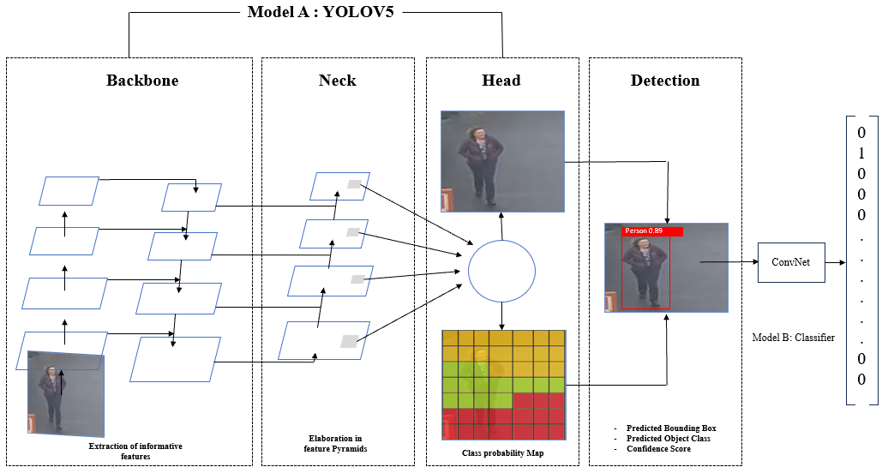

# AI-Powered Real-Time Detection for Railway Safety System

## Project Overview
This repository contains information about an **AI-Powered Real-Time Detection for Railway Safety System**. The system leverages **YOLOv5** for object detection and monitoring predefined safety zones to ensure the safety of individuals in railway environments. The theoretical components of the system are explained in detail.  
**Note:** The code for this project will be displayed after the paper is published.

---

## Table of Contents
1. [Introduction](#introduction)
2. [System Architecture](#system-architecture)
3. [Danger Detection Flowchart](#danger-detection-flowchart)
4. [YOLOv5 Model Workflow](#yolov5-model-workflow)
5. [Results(Detection and Safety Zones)](#results)
6. [References](#references)

---

## Introduction
Railway safety is a critical concern in modern transportation systems. Traditional monitoring methods often fail to provide timely warnings, resulting in preventable accidents. This project introduces an AI-powered detection framework capable of:

- Monitoring railway platforms and tracks using real-time video streams.
- Detecting individuals entering predefined danger zones.
- Generating alerts for immediate operator response.

The system is designed to integrate seamlessly into existing infrastructure and adapts to various environmental conditions such as lighting and weather.

---

## System Architecture

The system consists of the following components:

- **Real-Time Video Input:** Captured using surveillance cameras installed at railway stations.
- **Preprocessing Module:** Noise removal and frame extraction for video clarity.
- **YOLOv5 Object Detection Model:** Detects objects such as individuals and classifies them based on safety zones.
- **Safety Zone Classification:** Differentiates between safe (green) and danger (red) zones.
- **Alert System:** Generates visual and auditory alerts for immediate action.

**System Architecture Diagram:** 

---

## Danger Detection Flowchart
Below is the detailed flowchart illustrating the danger detection process:

1. **Real-Time Video Input**: Captures live feed from railway surveillance cameras.  
2. **Preprocessing**: Removes noise and extracts relevant frames for analysis.  
3. **Object Detection**: Detects entities like individuals using YOLO or VOLO models.  
4. **Safety Zone Classification**: Identifies objects in safe (green) or danger (red) zones.  
5. **Output Alerts**: Generates visual and sound alerts for individuals in the danger zone.

## YOLOv5 Model Workflow

The YOLOv5 model architecture follows these stages:

1. **Backbone:** Extracts key features from input video frames using a convolutional neural network (CNN).
2. **Neck:** Enhances feature extraction with a feature pyramid structure, improving detection of objects of various sizes.
3. **Head:** Generates class probability maps and bounding box predictions.
4. **Detection:** Outputs predictions with bounding boxes, confidence scores, and classifications.

**YOLOv5 Model Architecture:** 

The system demonstrated exceptional real-time performance:

1. **Detection Accuracy:** Achieved 90-95% accuracy in detecting individuals.
2. **Real-Time Processing:** Processed frames in under one second, enabling immediate alerts.
3. **Environmental Robustness:** Maintained high accuracy across various lighting and weather conditions.

### Bounding Box Calculation
The bounding boxes are calculated using:

- **bx = σ(tx) + cx**
- **by = σ(ty) + cy**
- **bw = pw × exp(tw)**
- **bh = ph × exp(th)**

Where `σ` is the sigmoid function, and `pw`/`ph` are prior dimensions of the bounding box.

---

## Results

The system detects individuals and classifies their locations into safety zones using the following classification:

- **Yellow Zone (Caution):** Represents areas near the edge of the platform or track that require increased awareness but do not immediately pose a threat.
- **Red Zone (Danger):** Indicates predefined safety zones near tracks or unsafe areas. Individuals detected in this zone trigger immediate alerts for safety intervention.

**Before Using the System:** 

**After Using the System : All individuals remain in the yellow caution zones, with no immediate danger detected.** 

 

**One individual has entered the red danger zone near the train, triggering an alert for safety intervention.**

The polygonal safety zones are defined within the video feeds and dynamically adjusted to adapt to station layouts.

---

## References

1. Gupta, A., Sharma, R., and Singh, K., "Real-Time Obstacle Detection Over Railway Track Using Deep Neural Networks," IEEE Transactions on Neural Networks and Learning Systems, 2022.
2. Jain, P., Patel, R., and Kumar, A., "A Camera and LiDAR Data Fusion Method for Railway Object Detection," IEEE Sensors Journal, 2022.
3. Kumar, V., Singh, M., and Rana, R., "Image Processing Based Real-Time Obstacle Detection and Alert System for Trains," Journal of Railway Engineering, 2023.
4. Mehta, S., Patel, R., and Yadav, N., "Real-Time Obstacle Detection Over Rails Using Deep Convolutional Neural Network," Journal of Artificial Intelligence and Robotics, 2022.
5. Singh, J., and Sharma, R., "A Real-Time and High-Accuracy Railway Obstacle Detection Method Using Lightweight CNN and Improved Transformer," IEEE Access, 2022.
6. Patil, A., Yadav, S., and Shah, R., "A Real-Time System for Video Surveillance of Unattended Outdoor Environments," in IEEE Transactions on Image Processing, 2021.
7. Zhang, Y., Li, S., and Xu, M., "A Dense Attention Railway Foreign Object Detection Algorithm Based on Mask R-CNN," Journal of Machine Vision, 2023.
8. Kumar, R., and Sharma, M., "Railway Obstacle Intrusion Warning Mechanism Integrating YOLO-Based Detection and Risk Assessment," IEEE Transactions on Intelligent Transportation Systems, 2020.
9. Kumar, R., and Singh, S., "AI Precision on Rails: Advanced Object Recognition for Train Track Safety – A Survey," IEEE Communications Surveys & Tutorials, 2023.
10. Soni, A., Kumar, P., and Yadav, S., "Railway Accident Reduction by Passenger Detection Using Machine Learning Techniques," International Journal of Computer Vision and Image Processing, 2022.
